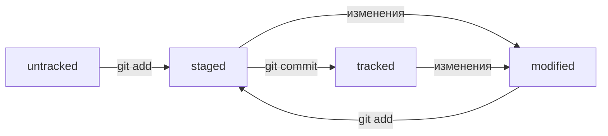

# Шпаргалка по Git
## Основные команды
- **git init** - инициализировать репозиторий
```
git init
```
- **git status** - вывести статус репозитория
```
git status
```
- **git add** - добавить файл(ы) в репозиторий
```
git add <filename>
git add .
git add --all
```
- **git commit** - сохранить состояние репозитория (сделать коммит)
```
git commit -m <message>
```
- **git commit --amend --no-edit** - дополнить последний коммит без изменения сообщения
- **git commit --amend -m <message>** - дополнить последний коммит с изменением сообщения
- **git log** - вывести историю коммитов
```
git log
```
- **git log** --oneline - вывести сокращенную информацию о коммитах
```
git log --oneline
```
- **git remote add** - связать локальный репозиторий с удаленным
```
git remote add origin <link_to_remote_repo>
```
- **git remote -v** - вывести информацию об удаленном репозитории
```
git remote -v
```
- **git push** - отправить изменения на удаленный репозиторий
```
git push -u <remote_repo_name> <branch_name> (связать локальную ветку с удаленной)
git push
```

## Статусная модель файлов репозитория

## Заметки
- файл **HEAD** в папке .git содержит ссылку на самый свежий коммит
- в командах вместо хеша последнего коммита можно использовать **HEAD**
