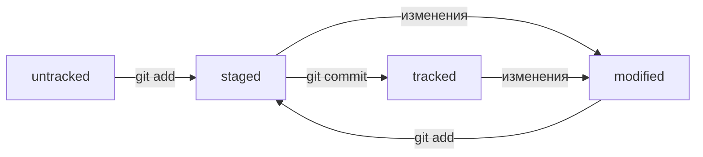

# Шпаргалка по Git
## Основные команды
- **git init** - инициализировать репозиторий
```
git init
```
- **git status** - вывести статус репозитория
```
- **git clone** - создать локальную копию удаленного репозитория
```
git clone <link>
```
git status
```
- **git add** - добавить файл(ы) в репозиторий
```
git add <filename>
git add .
git add --all
```
- **git commit** - сохранить состояние репозитория (сделать коммит)
```
git commit -m <message>
git commit --amend --no-edit (дополнить последний коммит без изменения сообщения)
git commit --amend -m <message> (дополнить последний коммит с изменением сообщения)
```
- **git log** - вывести историю коммитов
```
git log
```
- **git log** --oneline - вывести сокращенную информацию о коммитах
```
git log --oneline
```
- **git remote add** - связать локальный репозиторий с удаленным
```
git remote add origin <link_to_remote_repo>
```
- **git remote -v** - вывести информацию об удаленном репозитории
```
git remote -v
```
- **git push** - отправить изменения на удаленный репозиторий
```
git push -u <remote_repo_name> <branch_name> (связать локальную ветку с удаленной)
git push
```
- **git restore** - откатить изменения файла(ов)
```
git restore <filename> (откатить изменения файла по последней сохраненной версии (в коммите или staging)
git restore --staged <filename> (перевести из staged в modified или untracked)
```
- **git reset --hard <commit_hash>** - откатить историю до коммита с хэшем commit_hash
```
git reset --hard <commit_hash>
```
- **git diff** - показать изменения между коммитами или ветками
```
git diff (показать изменения между закоммиченными файлами и modified)
git diff --staged (показать измерения между staged и modified)
git diff <hash_a> <hash_b> (показать изменения между коммитами с хэшем а и хэшем b)
git diff <branch_a> <branch_b> (изменения между ветками branch_a и branch_b)
git diff HEAD~1 HEAD (изменения между предпоследним коммитом и последним (суффикс ~N))
```
- **git branch** - действия с ветками репозитория
```
git branch (вывести список веток репозитория)
git branch <branch_name> (создать ветку с именем branch_name)
git branch -a (вывести список веток как локальных, так и на удаленном репозитории)
git branch -D <branch_name> (удалить ветку branch_name)
git branch -d <branch_name> (безопасно удалить ветку branch_name, когда ветка влита в другую)
```
- **git checkout** - переключение между ветками репозитория
```
git checkout <branch_name> (переключиться на ветку branch_name)
git checkout -b <branch_name> (создать новую ветку branch_name и переключиться на нее)
```
- **git merge <branch_name>** - объединить ветку branch_name  текущей
```
git merge <branch_name>
```
- **git pull** - получить изменения из удаленного репозитория в локальный
```
git pull
```
## Статусная модель файлов репозитория

## Заметки
- файл **HEAD** в папке .git содержит ссылку на самый свежий коммит
- в командах вместо хеша последнего коммита можно использовать **HEAD**
